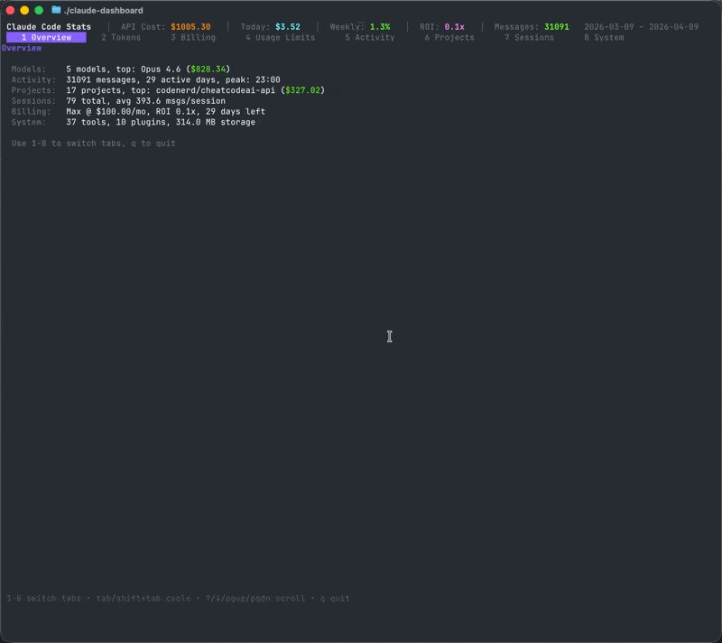

# Claude Code Usage CLI Dashboard

A single-binary CLI dashboard for [Claude Code](https://docs.anthropic.com/en/docs/claude-code) usage analytics, built with [Bubble Tea](https://github.com/charmbracelet/bubbletea). It reads your local session transcripts from `~/.claude/`, estimates the equivalent API costs, and presents everything in an interactive terminal UI.

Inspired by [claude-code-stats](https://github.com/AeternaLabsHQ/claude-code-stats) and usage-limit research at [she-llac.com/claude-limits](https://she-llac.com/claude-limits).



## Features

- **Overview** -- Quick summary of your estimated API value, total messages, sessions, and output tokens
- **Token Breakdown** -- Daily and cumulative cost charts broken down by model, plus cost-per-token-type analysis
- **Activity Patterns** -- See when you code most: daily message counts, hourly heatmap, and weekday distribution
- **Project Rankings** -- Compare your projects by estimated cost, number of sessions, messages, and transcript size
- **Session Explorer** -- Dig into individual sessions with model breakdown, tool usage, and the first prompt you sent
- **Billing & ROI** -- Compare your subscription plan(s) against what the same usage would cost via the API
- **System** -- Check installed plugins, storage usage, todo progress, and file-history stats
- **Credit Limits** -- Track credit consumption against your plan's caps, with session and weekly windows plus projections

## Install

### Pre-built Binary

Download from [Releases](https://github.com/eng1n88r/claude-code-usage-dashboard/releases) for your platform.

### From Source

```bash
go install github.com/eng1n88r/claude-code-usage-dashboard/cmd/claude-dashboard@latest
```

## Development Setup

Requires Go 1.25+.

```bash
# Build
go build -o claude-dashboard ./cmd/claude-dashboard

# Run
./claude-dashboard

# Create your config
cp .env.example .env
```

## Testing

```bash
go test ./...
```

Tests cover pricing, cost calculation, credit calculation, date clamping, session parsing, config loading, and TUI helpers.

## Usage

```bash
claude-dashboard                           # Extract data and launch the TUI
claude-dashboard --no-refresh              # Launch TUI using cached data
claude-dashboard --json                    # Extract and dump JSON to stdout
claude-dashboard --all                     # Print all sections to the terminal
claude-dashboard --section tokens,plan     # Print specific sections only
claude-dashboard --limit 10               # Limit table rows (default: 20)
claude-dashboard --quiet                   # Suppress progress output
claude-dashboard --config ./.env            # Use a specific config file
claude-dashboard --output ./out            # Set output directory (default: ./public)
claude-dashboard extract                   # Extract only, write JSON to disk
claude-dashboard version                   # Print version
```

### Keybindings

| Key | Action |
|-----|--------|
| `1`-`8` | Jump to a tab |
| `Tab` / `Shift+Tab` | Cycle through tabs |
| `Up` / `Down` / `PgUp` / `PgDn` | Scroll |
| `q` / `Ctrl+C` | Quit |

## Configuration

Create a config file by copying the example:

```bash
cp .env.example .env
```

See [`.env.example`](.env.example) for all available options:

| Variable | Default | Description |
|----------|---------|-------------|
| `PLAN_NAME` | | Your subscription plan (`Pro` or `Max`) |
| `PLAN_TIER` | | Credit tier: `pro`, `5x`, or `20x` (inferred from plan name if empty) |
| `PLAN_START` | | ISO date when your plan started |
| `PLAN_END` | | ISO date when your plan ended (leave empty for active plans) |
| `PLAN_COST_USD` | | Monthly cost in USD |
| `PLAN_BILLING_DAY` | | Day of the month billing occurs (1-31) |

### Multiple Plans

You can track historical plans by adding numbered suffixes (`_2`, `_3`, etc.):

```env
PLAN_NAME=Max
PLAN_TIER=5x
PLAN_START=2026-01-23
PLAN_COST_USD=93.00
PLAN_BILLING_DAY=23

PLAN_2_NAME=Pro
PLAN_2_START=2025-01-01
PLAN_2_END=2025-12-31
PLAN_2_COST_USD=20.00
```

## Building Releases

Uses [GoReleaser](https://goreleaser.com/):

```bash
goreleaser release --snapshot --clean
# Targets: linux/darwin/windows x amd64/arm64
```

## License

MIT
