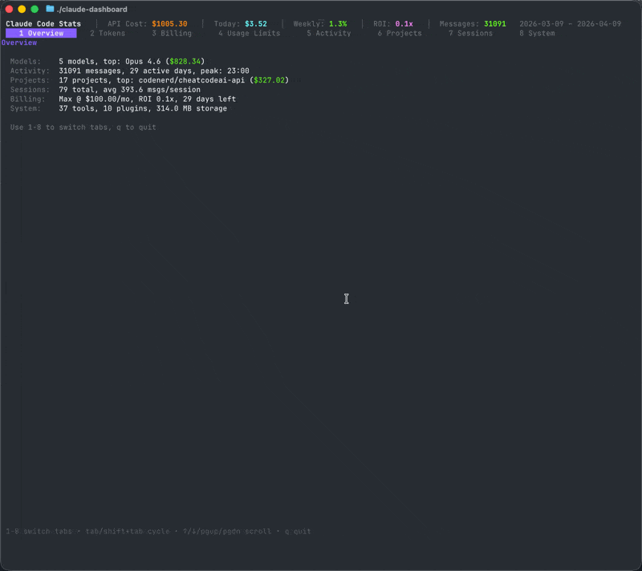

# Claude Code Usage CLI Dashboard

A single-binary CLI dashboard for [Claude Code](https://docs.anthropic.com/en/docs/claude-code) usage analytics, built with [Bubble Tea](https://github.com/charmbracelet/bubbletea). It reads your local session transcripts from `~/.claude/`, estimates the equivalent API costs, and presents everything in an interactive terminal UI.

Inspired by [claude-code-stats](https://github.com/AeternaLabsHQ/claude-code-stats) and usage-limit research at [she-llac.com/claude-limits](https://she-llac.com/claude-limits).



## Features

- **Overview** -- Quick summary of your estimated API value, total messages, sessions, and output tokens
- **Token Breakdown** -- Daily and cumulative cost charts broken down by model, plus cost-per-token-type analysis
- **Activity Patterns** -- See when you code most: daily message counts, hourly heatmap, and weekday distribution
- **Project Rankings** -- Compare your projects by estimated cost, number of sessions, messages, and transcript size
- **Session Explorer** -- Dig into individual sessions with model breakdown, tool usage, and the first prompt you sent
- **Billing & ROI** -- Compare your subscription plan(s) against what the same usage would cost via the API
- **System** -- Check installed plugins, storage usage, todo progress, and file-history stats
- **Credit Limits** -- Session (5-hour), weekly, and Fable credit windows matching the Claude app's usage popup, with projections

## Install

### Pre-built Binary

Download the archive for your platform from [Releases](https://github.com/eng1n88r/claude-code-usage-dashboard/releases). Releases are packaged as `.tar.gz` (Linux/macOS) or `.zip` (Windows) and contain the `claude-dashboard` binary along with `.env.example`, `README.md`, and `LICENSE`.

**Linux / macOS:**

```bash
# Extract (replace VERSION/OS/ARCH to match the file you downloaded,
# e.g. claude-code-usage-dashboard_1.2.3_darwin_arm64.tar.gz)
tar -xzf claude-code-usage-dashboard_VERSION_OS_ARCH.tar.gz

# Run it
./claude-dashboard

# Optional: move it onto your PATH so you can run it from anywhere
sudo mv claude-dashboard /usr/local/bin/
claude-dashboard
```

On macOS, if Gatekeeper blocks the unsigned binary, clear the quarantine flag first:

```bash
xattr -d com.apple.quarantine claude-dashboard
```

**Windows:**

Extract the `.zip` archive, then run `claude-dashboard.exe` from a terminal (PowerShell or Command Prompt) in the extracted folder.

### From Source

```bash
go install github.com/eng1n88r/claude-code-usage-dashboard/cmd/claude-dashboard@latest
```

## Development Setup

Requires Go 1.25+.

```bash
# Build
go build -o claude-dashboard ./cmd/claude-dashboard

# Run
./claude-dashboard

# Create your config
cp .env.example .env
```

## Testing

```bash
go test ./...
```

Tests cover pricing, cost calculation, credit calculation, date clamping, session parsing, config loading, and TUI helpers.

## Usage

```bash
claude-dashboard                           # Extract data and launch the TUI
claude-dashboard --no-refresh              # Launch TUI using cached data
claude-dashboard --json                    # Extract and dump JSON to stdout
claude-dashboard --all                     # Print all sections to the terminal
claude-dashboard --section tokens,plan     # Print specific sections only
claude-dashboard --limit 10               # Limit table rows (default: 20)
claude-dashboard --quiet                   # Suppress progress output
claude-dashboard --config ./.env            # Use a specific config file
claude-dashboard --output ./out            # Set output directory (default: ./public)
claude-dashboard extract                   # Extract only, write JSON to disk
claude-dashboard version                   # Print version
```

### Keybindings

| Key | Action |
|-----|--------|
| `1`-`8` | Jump to a tab |
| `Tab` / `Shift+Tab` | Cycle through tabs |
| `Up` / `Down` / `PgUp` / `PgDn` | Scroll |
| `q` / `Ctrl+C` | Quit |

## Configuration

Create a config file by copying the example:

```bash
cp .env.example .env
```

See [`.env.example`](.env.example) for all available options:

| Variable | Default | Description |
|----------|---------|-------------|
| `PLAN_NAME` | | Your subscription plan (`Pro` or `Max`) |
| `PLAN_TIER` | | Credit tier: `pro`, `5x`, or `20x` (inferred from plan name if empty) |
| `PLAN_START` | | ISO date when your plan started |
| `PLAN_END` | | ISO date when your plan ended (leave empty for active plans) |
| `PLAN_COST_USD` | | Monthly cost in USD |
| `PLAN_BILLING_DAY` | | Day of the month billing occurs (1-31) |
| `WEEKLY_RESET` | | Weekly limit reset schedule, e.g. `Thu 10:00` (24h, local time). Empty = rolling last 7 days |
| `WEEKLY_FABLE_LIMIT` | | Credit cap for the `Weekly - Fable` bucket. Empty = show credits without a percentage |

### Usage Limit Windows

The 5-hour and weekly windows mirror the "Plan usage limits" popup in the Claude app:

- **Session (5-hour)** -- starts at the first message of the most recent session.
- **Weekly** -- set `WEEKLY_RESET` to your plan's reset time shown in the app ("Resets Thu 10:00 AM" → `WEEKLY_RESET=Thu 10:00`). The window then covers credits since the last reset. Without it, the dashboard falls back to a rolling 7-day sum, which also counts usage the app has already reset.
- **Weekly - Fable** -- Fable/Mythos usage tracked against its own cap, like the app's separate row. Set `WEEKLY_FABLE_LIMIT` to show a percentage.

**Scope:** only local Claude Code transcripts (`~/.claude/`) are counted. Usage from claude.ai web, desktop, and mobile shares the same plan limits but leaves no local transcripts, so dashboard percentages are a lower bound compared to the app.

### Multiple Plans

You can track historical plans by adding numbered suffixes (`_2`, `_3`, etc.):

```env
PLAN_NAME=Max
PLAN_TIER=5x
PLAN_START=2026-01-23
PLAN_COST_USD=93.00
PLAN_BILLING_DAY=23

PLAN_2_NAME=Pro
PLAN_2_START=2025-01-01
PLAN_2_END=2025-12-31
PLAN_2_COST_USD=20.00
```

## Building Releases

Uses [GoReleaser](https://goreleaser.com/):

```bash
goreleaser release --snapshot --clean
# Targets: linux/darwin/windows x amd64/arm64
```

## License

MIT
